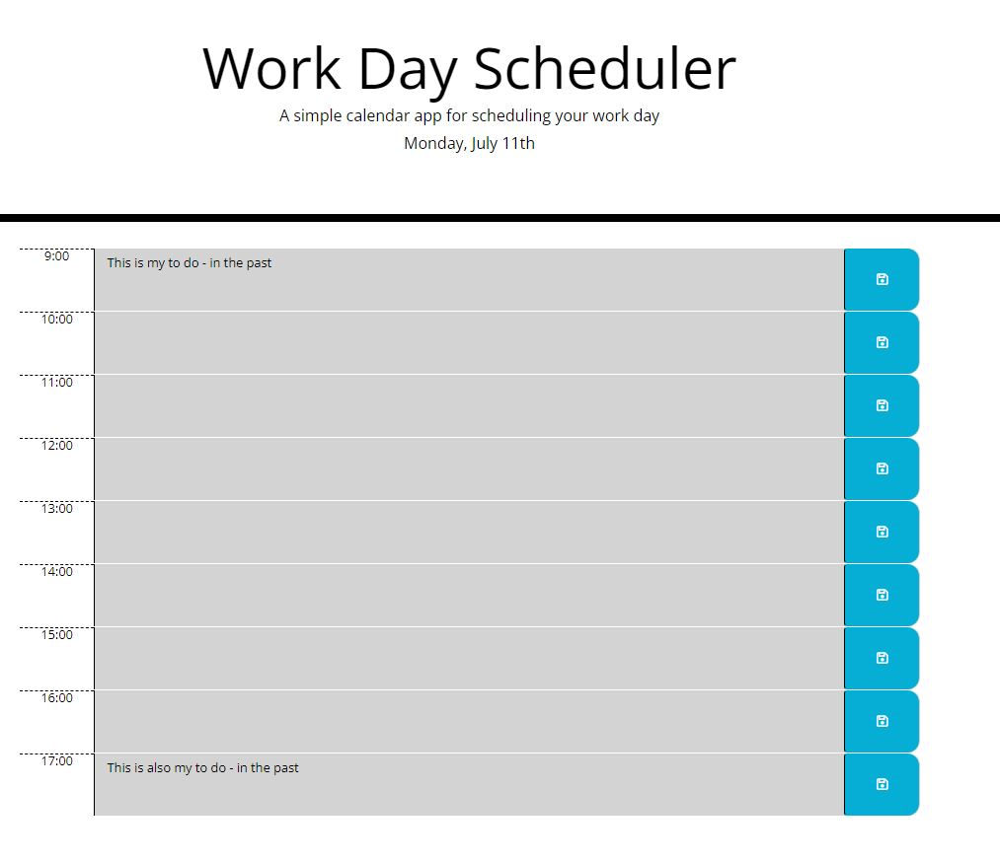

# 05-Work-Day-Scheduler

The challenge is to build a calendar application that allows a user to save events for each hour of the day by modifying starter code. This app will run in the browser and feature dynamically updated HTML and CSS powered by jQuery.

## Acceptance Criteria
- GIVEN I am using a daily planner to create a schedule
- WHEN I open the planner THEN the current day is displayed at the top of the calendar
- WHEN I scroll down THEN I am presented with timeblocks for standard business hours
- WHEN I view the timeblocks for that day THEN each timeblock is color coded to indicate whether it is in the past, present, or future
- WHEN I click into a timeblock THEN I can enter an event
- WHEN I click the save button for that timeblock THEN the text for that event is saved in local storage
- WHEN I refresh the page THEN the saved events persist

## Screenshot

## Particular Challenges 
- Using JQuery
- using local storage 
- usage of new APIs
- creating an object using the date and text input
- making sure that the local storage is updated each day
- using the each function

## Some Updates to the starter code
- move scripts to bottom of body
- update JQuery link
- update Fontawesome link

## Links
- [Deployment Link](https://henniepenny.github.io/05-Work-Day-Scheduler/)
- [Repository Link](https://github.com/HenniePenny/05-Work-Day-Scheduler)